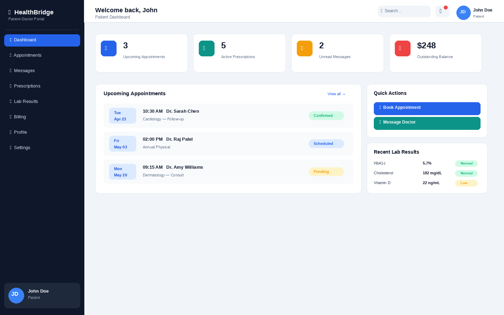
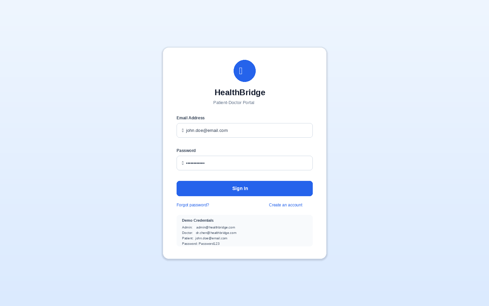
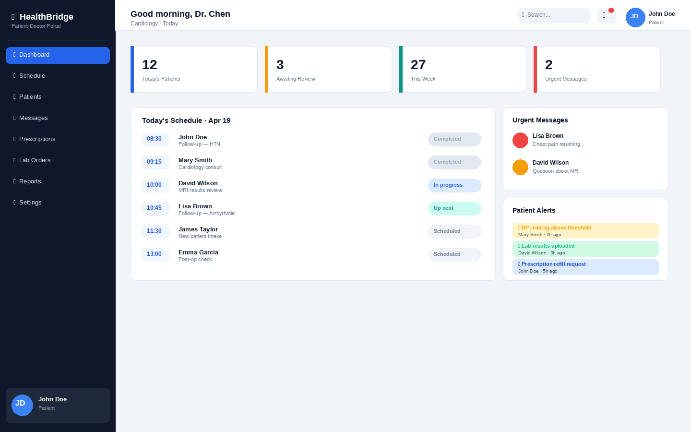
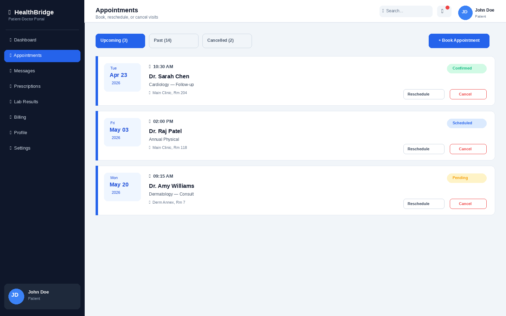
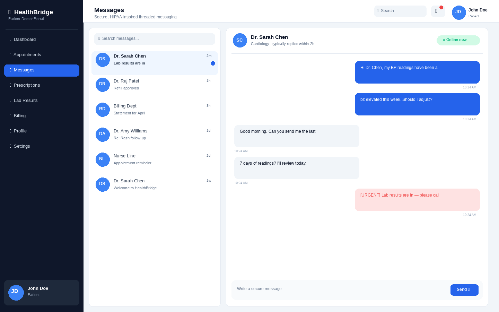
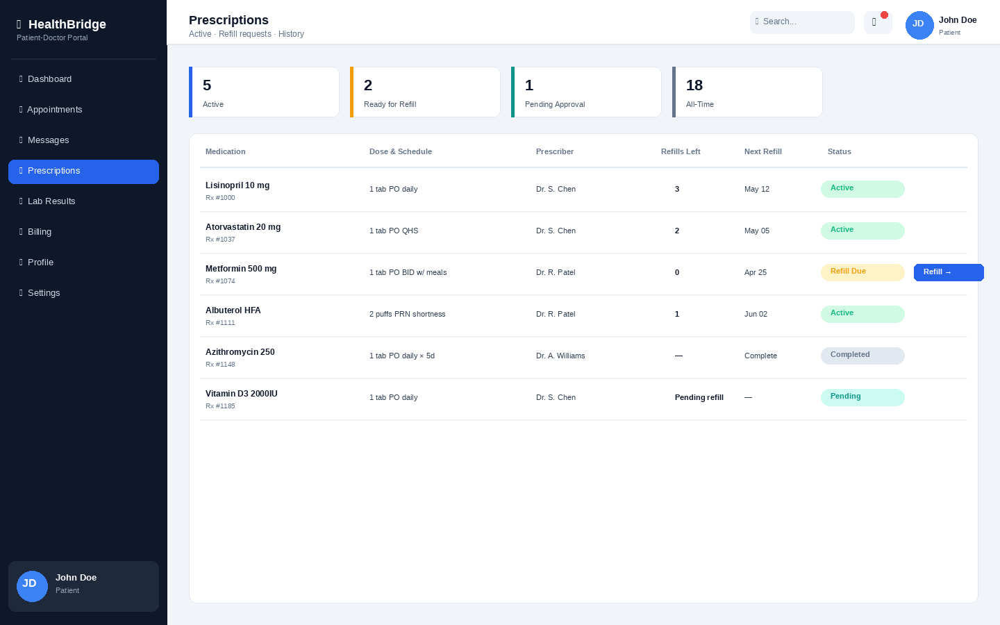

# HealthBridge — Doctor-Patient Portal

[](https://github.com/AwpDemon/doctor-patient-portal/actions/workflows/ci.yml)
[](LICENSE)


**University of Georgia · MIST 4610 Data Management and Analytics · Spring 2025**

**Highlights**
- Full-stack SPA (Node + Express + SQLite + vanilla-JS client) with **11 UI modules** and **30+ REST endpoints** across appointments, messaging, prescriptions, billing, labs, and admin.
- Auth stack with real teeth: bcrypt (12 rounds), session store, **2FA via TOTP** (Google Authenticator compatible), password-reset token flow, rate-limited login, and RBAC splitting doctor / patient / admin views.
- **21-test Jest/Supertest suite** covers registration, login, reset, 2FA, password change, session lifecycle, RBAC, and rate-limiting — runs green in CI.
- Database initialized with a **realistic seed**: 3 roles, 4 doctors, 6 patients, prescriptions, lab results, and billing rows, so the demo looks like a populated clinic on first boot.



## Screens

| Login | Patient Dashboard |
|:---:|:---:|
|  |  |

| Doctor Dashboard | Appointments |
|:---:|:---:|
|  |  |

| Secure Messaging | Prescriptions |
|:---:|:---:|
|  |  |

*(Screenshots are generated from the real design tokens in `public/css/styles.css` via `docs/build_screenshots.py` — same palette, layout, and typography as the running app.)*

## What it does

HealthBridge simulates a real doctor-patient portal end-to-end. Patients can see their upcoming appointments, request refills, view lab results with reference ranges, pay bills, and message their provider. Doctors get a per-day schedule, a patient roster, an inbox with urgent-flagged messages, and prescription/lab-order flows. Admins can manage users and pull the audit log.

It's a class project, so the scope is "one clinic, one week of realistic traffic," not production HIPAA — but the auth and audit pieces are built the way you'd build them for real.

## What I actually learned building it

**Auth is a design problem, not an API problem.** The part of this that took the longest wasn't writing `POST /api/auth/login` — it was deciding where the boundary between "session management" and "route-level authorization" lives, so that adding a new role later didn't mean touching every route. Middleware factory that takes a list of allowed roles and returns a guard, RBAC checks declared at route mount time, single audit helper threaded through the middleware.

**SQLite is shockingly capable for a small realistic demo.** Turning on WAL mode (`PRAGMA journal_mode=WAL`) gets you concurrent reads during writes, which is enough to run a Jest suite, a seed script, and a dev server at the same time without locking. No Postgres to babysit in class or in CI.

**2FA is a UX problem the first time you ship it.** Speakeasy + QR code + a 6-digit verify was the easy part. The hard part was making sure that if a user enables 2FA, the password reset flow still knows about it, and that "disable 2FA" requires re-entering the current password. Lots of "what if the user does X after Y" edge cases.

**Tests that touch the database need to own the database.** The test suite spins up its own SQLite file per `beforeAll` and blows it away after. Trying to share state with the dev DB is how flaky tests are born.

## Tech stack

| Layer | Choice |
|-------|--------|
| Server | Node 18 + Express 4 |
| Data   | SQLite via `better-sqlite3`, WAL mode |
| Auth   | `express-session` + `connect-sqlite3`, `bcryptjs` (12 rounds), `speakeasy` TOTP |
| Hardening | `helmet`, CORS allowlist, `express-validator`, per-route rate limits |
| Client | Vanilla ES6+ SPA (hash router) + Material Symbols |
| Test   | Jest + Supertest, 21 cases, CI on GitHub Actions |

## Quick start

```bash
git clone https://github.com/AwpDemon/doctor-patient-portal.git
cd doctor-patient-portal
npm install
cp .env.example .env        # or set SESSION_SECRET yourself
npm run seed                # populates SQLite with demo data
npm run dev                 # http://localhost:3000
```

### Demo accounts (password `Password123` for all)

| Role | Email | Notes |
|------|-------|-------|
| Admin | admin@healthbridge.com | Full system access, user management, audit log |
| Doctor | dr.chen@healthbridge.com | Cardiology, has existing patients |
| Doctor | dr.patel@healthbridge.com | Family Medicine |
| Patient | john.doe@email.com | Appointments, prescriptions, lab results |
| Patient | mary.smith@email.com | Appointments and messages |
| Patient | david.wilson@email.com | MRI results, active prescriptions |

## Feature inventory

### Auth & security
- Session-based login/logout, registration with role selection
- Password reset via signed token flow
- TOTP 2FA (Google Authenticator compatible) with enable / verify / disable
- Authenticated password change
- Session inactivity timeout with activity tracking
- Per-route rate limiting (aggressive on `/login` and `/reset-password`)
- Role-based access control — doctor / patient / admin each get a different view
- Audit logging of security-critical actions
- Password strength indicator with real-time feedback

### Clinical / product
1. **Dashboard** — role-specific stats, upcoming appointments, quick actions
2. **Patient Records** — profile with medical-history tabs
3. **Appointment Scheduling** — book / reschedule / cancel with real-time slot availability
4. **Secure Messaging** — threaded, urgent-flag, read receipts
5. **Prescriptions** — create, edit, refill requests, pharmacy details
6. **Billing & Payments** — invoices, payment processing, insurance split
7. **Lab Results** — color-coded results with reference ranges
8. **Profile Management** — personal info, emergency contacts, insurance
9. **Notifications** — polled panel, categorized by type
10. **Global Search** — across patients, doctors, appointments, meds
11. **Admin Panel** — user management, system stats, audit log viewer

## API shape

~30 REST endpoints, grouped by resource. Highlights:

**Auth** — `POST /api/auth/{register,login,logout}`, `GET /api/auth/{session,me}`, password reset (`forgot-password` → `reset-password`), change-password, and the 2FA setup/enable/verify/disable quartet.

**Appointments** — `GET /api/appointments[/upcoming|/today|/available-slots|/stats|/:id]`, `POST /api/appointments`, `PUT /api/appointments/:id`, `PUT /api/appointments/:id/cancel`.

Routes for messages, prescriptions, patients, and dashboard live in their respective files under `routes/`. Each route file is self-contained — RBAC is enforced via middleware at mount time.

## Project layout

```
doctor-patient-portal/
├── server.js                 Express entry point + session store + CSP
├── config/db.js              SQLite init + schema + WAL mode
├── middleware/auth.js        Session + RBAC + activity tracking
├── models/                   User, Appointment, Message, Prescription
├── routes/                   auth, appointments, messages, patients,
│                             prescriptions, dashboard
├── public/
│   ├── css/styles.css        Design system (~1,200 lines)
│   ├── js/                   SPA router, per-module UI (12 files)
│   └── index.html            SPA shell
├── data/seed.js              Demo data for 3 roles, 4 docs, 6 patients
├── tests/auth.test.js        Jest/Supertest — 21 cases
├── docs/
│   ├── build_screenshots.py  Regenerates README renders from CSS tokens
│   └── screenshots/          6 PNGs referenced above
├── .github/workflows/ci.yml  npm ci → seed → test → boot + /api/health
└── .env.example
```

## Testing

```bash
npm test                  # 21 passing
npx jest --coverage       # coverage report
```

The suite covers: registration validation, login with valid/invalid/non-existent creds, session read, `/api/auth/me`, full password-reset flow, password change, logout, protected-route 401s, and the `/api/health` endpoint. CI runs the same suite plus a live-server smoke test against `/api/health`.

## Team (MIST 4610 group project)

| Member | Role | Key contributions |
|--------|------|-------------------|
| **Ali Askari** | Lead developer | Architecture, backend API, database schema, auth/2FA |
| Sarah Mitchell | Frontend | UI/UX, CSS design system, responsive layout, dashboard |
| James Park | Full stack | Messaging, notifications, global search |
| Maria Santos | Backend | Patient records, prescriptions, billing, seed data |
| David Kim | QA | Test suite, security review, lab results, docs |

## Timeline

| Phase | Period | Deliverables |
|-------|--------|--------------|
| 1 | Jan – Feb 2025 | Requirements, DB schema, project scaffold |
| 2 | Feb – Mar 2025 | Auth, user models, initial API |
| 3 | Mar – Apr 2025 | Appointments, messaging, prescriptions |
| 4 | Apr – May 2025 | SPA frontend, dashboards, UI polish |
| 5 | May – Jun 2025 | Billing, labs, search, admin |
| 6 | Jun – Jul 2025 | Tests, security review, docs |

## License

MIT — see [`LICENSE`](LICENSE).

## Acknowledgments

- UGA MIST 4610 (Data Management and Analytics) course staff for project guidance
- [Material Symbols](https://fonts.google.com/icons) icon family
- [Inter](https://rsms.me/inter/) typeface by Rasmus Andersson
- SQLite and the `better-sqlite3` maintainers
